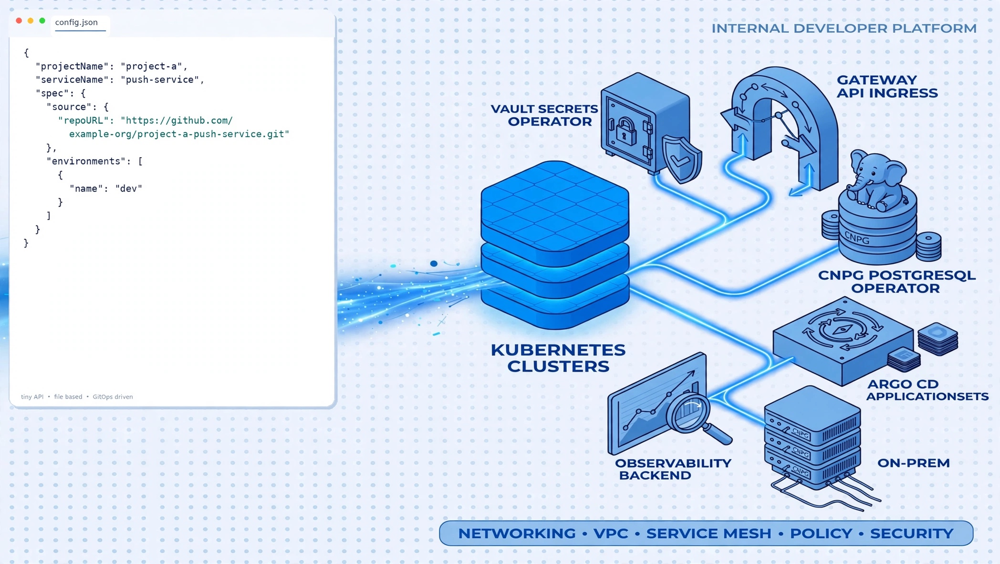

# minimal-platform-demo

Companion to the blog article about building an internal developer platform backwards from one reviewed `config.json`. 

[https://looks.ratherbumpy.com/2026/09/a-powerful-platform-can-start-real-tiny.html](https://looks.ratherbumpy.com/2026/09/a-powerful-platform-can-start-real-tiny.html)

Clone this repository and run one command to stand up the model on a local Kubernetes cluster.



## Demo Scope vs. Production Reality

This repository is a self-contained, educational model designed to illustrate the control plane mechanics described in the blog post. In a real-world enterprise IDP, several structural differences and architectural separations apply:

- **Repository Separation & Cross-Repo GitOps**:
In production, the service registry lives in its own dedicated repository, owned by developers and subject to strict PR policy checks. Merges to that registry trigger automated downstream workflows in a separate platform GitOps/infrastructure repository to deliver platform updates, Vault roles, and Argo CD configurations. In this demo, the registry, charts, OpenTofu modules, and CI workflows are consolidated into a single repo for simplicity and local execution.
- **Cluster Inventory & Placement**:
The blog article discusses multi-cluster placement and environments mapped across diverse cloud providers (`clouds`) backed by a cluster inventory catalog. In this demo, there is no cluster inventory: a single local Minikube (or Kind) cluster hosts all namespaces and workloads, and the `clouds` field serves as documented placement intent rather than multi-target routing.
- **Foundation Infrastructure Pre-exists**:
The demo focuses entirely on the developer-facing platform layer: operators, CRDs, namespace governance, Vault integration, and Argo CD ApplicationSets. In production, foundational infrastructure—such as production-grade managed Kubernetes clusters (AKS/EKS), virtual networks, peering, subnets, DNS forwarding, and cloud identity federations (Workload Identity / UAMI)—is assumed to pre-exist, managed by separate foundational GitOps and IaC lifecycles outside the scope of the developer registry.
- **Security & Ephemeral Setup**:
Vault runs in dev mode using a hardcoded root token and in-memory storage. Passwords and secrets are generated locally or checked in for demonstration purposes.

---


## One command

```bash
git clone https://github.com/kayahk/minimal-platform-demo.git
cd minimal-platform-demo
./scripts/up.sh
```

Requires a macOS or Linux host (Windows via WSL2) with bash, Docker, kubectl, Helm, OpenTofu, and Minikube. `up.sh` creates or reuses the `platform-demo` Minikube profile. The Docker engine needs 4 CPUs and 6 GiB of memory for that profile.

To use Kind instead, set `PLATFORM_DEMO_RUNTIME=kind`; if `kind` is missing, the script downloads it into `.bin/`.

Tear down with `./scripts/down.sh` (this stops the demo-app port-forward and removes the cluster for the active `PLATFORM_DEMO_RUNTIME`, including the Minikube profile).

## Access the demo

`./scripts/up.sh` prints the live URLs. There are **three different endpoints**. Do not open Argo CD on port 9090, and do not port-forward Argo CD onto 8081.

| What | Minikube (default) | Kind | How to authenticate |
| --- | --- | --- | --- |
| **Argo CD UI** (GitOps console, not the workload) | `http://$(minikube ip --profile platform-demo):30080` | `http://127.0.0.1:8081` | user `admin`; password from the secret below |
| **push-service** (hello-world app that shows Vault secrets) | `http://127.0.0.1:9090` | `http://127.0.0.1:9090` | none. `up.sh` port-forwards `svc/int` in `project-a-int` |
| **Vault** (optional KV inspector) | `http://$(minikube ip --profile platform-demo):30200` | `http://127.0.0.1:8200` | token `root` |

Argo CD password:

```bash
kubectl -n argocd get secret argocd-initial-admin-secret -o jsonpath='{.data.password}' | (base64 --decode 2>/dev/null || base64 -d)
echo
```

### 1. Argo CD UI

This is the GitOps console. On Minikube it is NodePort **30080** on the Minikube node IP. On Kind, host port **8081** is mapped to that NodePort. Do not `kubectl port-forward` Argo CD onto 8081 (Kind already binds it), and do not use 9090.

Log in as `admin`, then open application `project-a-push-service-int`. **Synced** and **Healthy** means the platform turned `registry/dev/project-a/push-service/config.json` into a running workload. The application tree should include `VaultStaticSecret` objects.

### 2. push-service (hello-world)

This is the demo application, not Argo CD. `up.sh` forwards it to **http://127.0.0.1:9090**.

```bash
curl -s http://127.0.0.1:9090/api/secrets
```

The page should show `message=hello from Vault (int)` from `secrets/int/project-a-push-service/demo`. Those values are not in Git; Vault Secrets Operator copied them into the pod.

```bash
kubectl -n project-a-int get vaultauth,vaultstaticsecret,secret
```

If the forward is not running:

```bash
kubectl -n project-a-int port-forward --address 127.0.0.1 svc/int 9090:80
```

### 3. Vault

Optional. Dev-mode Vault with token `root`. On Minikube it is NodePort **30200** on the Minikube node IP. On Kind, host port **8200** is mapped to that NodePort.

Seeded paths:

```text
secrets/int/project-a-push-service/demo
configurations/int/project-a-push-service/demo
```

If the Minikube NodePort IP is unreachable:

```bash
minikube service -n vault vault --url --profile platform-demo
minikube service -n argocd argo-cd-argocd-server --url --profile platform-demo
```

Argo CD clones a local snapshot of `charts/`, `apps/`, and `registry/` rather than GitHub `main`. After editing those trees, re-run `./scripts/up.sh` so the snapshot refreshes.

## What you get

The registry file is the user-facing API:

```text
registry/dev/project-a/push-service/config.json
```

From `projectName: project-a`, `serviceName: push-service`, and environment `int`, the platform derives:

```text
namespace:       project-a-int
Application:     project-a-push-service-int
Helm release:    int
service account: project-a-push-service-sa
Vault role:      project-a-push-service
Vault policy:    project-a-push-service-access
database name:   int-app
```

The same file also produces `project-a-dev` for the `dev` stage. That environment sets `hibernate: true`, so the namespace gets `downscaler/uptime: Mon-Fri 08:00-18:00` in the **host timezone** (`up.sh` detects it; override with `TZ=Area/City`). GoKubeDownscaler scales its Deployments to zero outside that window. `project-a-int` stays up. The folder `dev/` is the onboarding tree, not the environment name.

## Layout

```text
.github/workflows/  CI validation workflow
registry/           service contract (config.json) and JSON Schema
terraform/          OpenTofu root module, lockfile, and cluster-operator modules
  modules/          argocd, vault, vault-secrets-operator, cnpg-operator,
                    kyverno, namespace-hibernation (GoKubeDownscaler)
policies/           Vault policy source of truth and Kyverno ClusterPolicies
charts/             shared workload chart and CNPG database claim chart
apps/               values for push-service
scripts/            up.sh, down.sh, registry validation, policy check runner
tests/              pytest contract and CI workflow assertions
img/                README headliner diagram
```

## Acknowledgements

This repository is an independent educational example. It is not affiliated with, endorsed by, or sponsored by the owners of the products it uses.

The demo installs those products from upstream at runtime (Helm charts and container images). Their licenses stay with those upstream artifacts. This repository’s MIT license covers only the original files in this tree.

Names used here are trademarks of their respective owners, including Kubernetes, Argo, Helm, OpenTofu, Kyverno, CloudNativePG, Minikube, kind, Docker, Vault, HashiCorp, and GoKubeDownscaler. They appear only to identify the software the demo actually runs.

